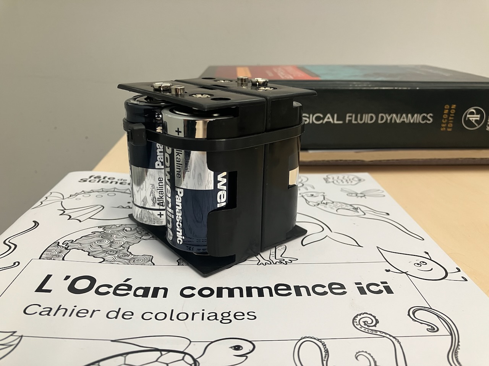
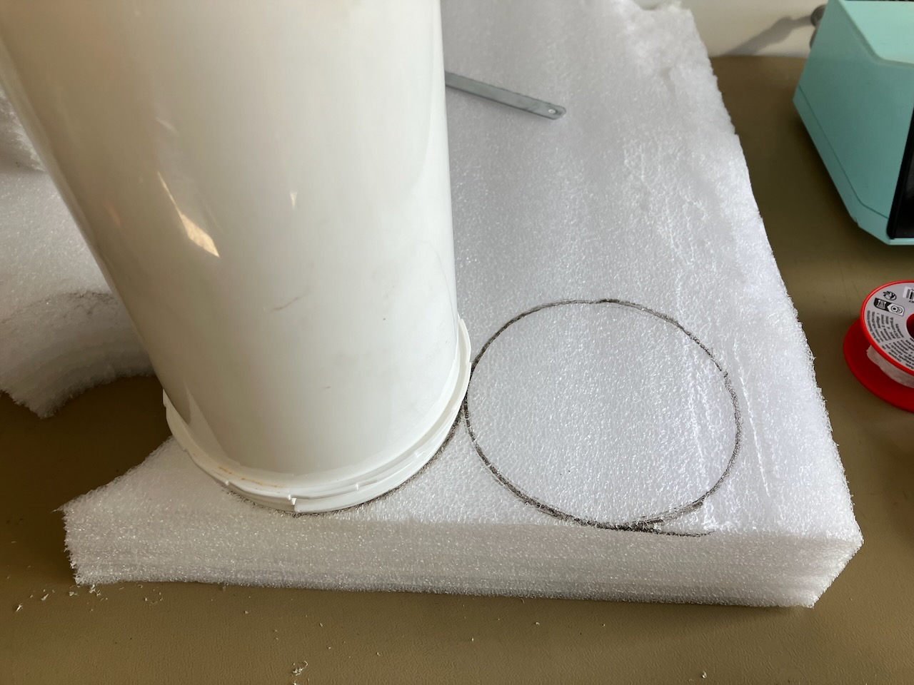
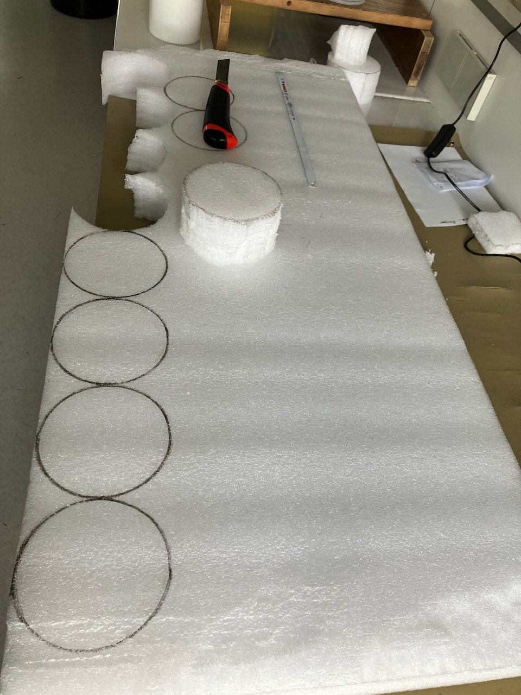
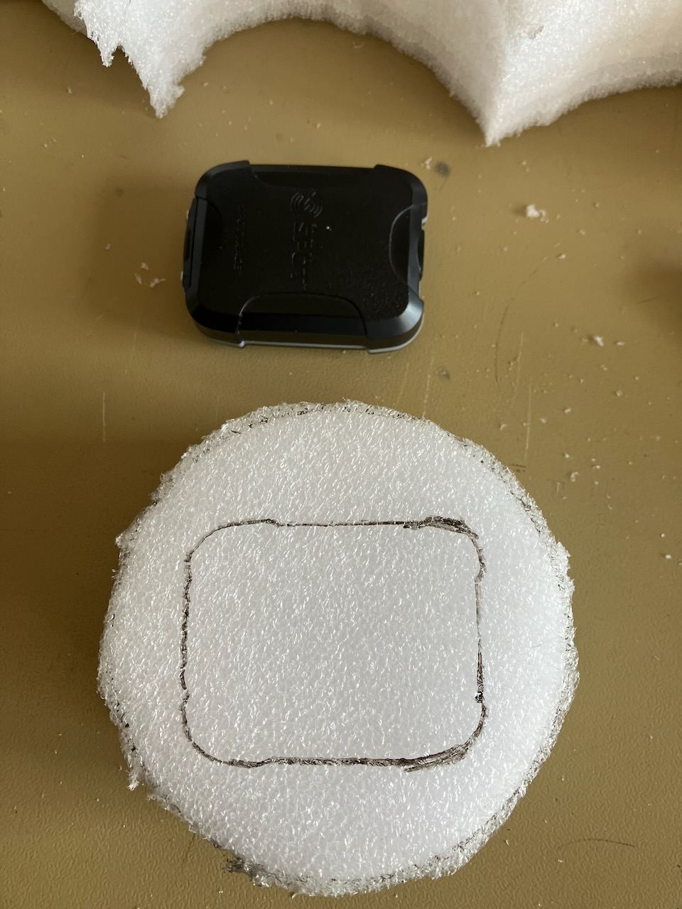
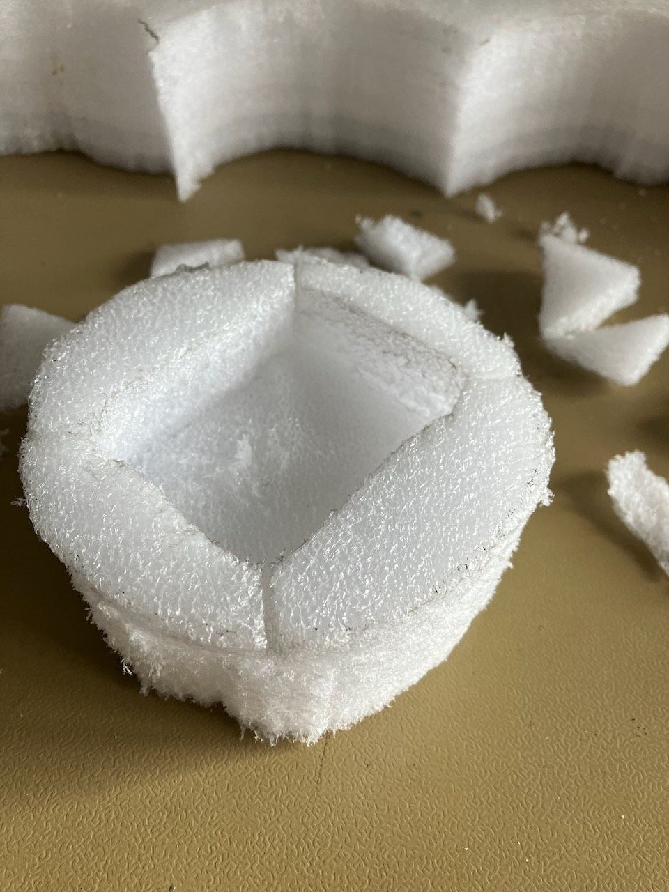
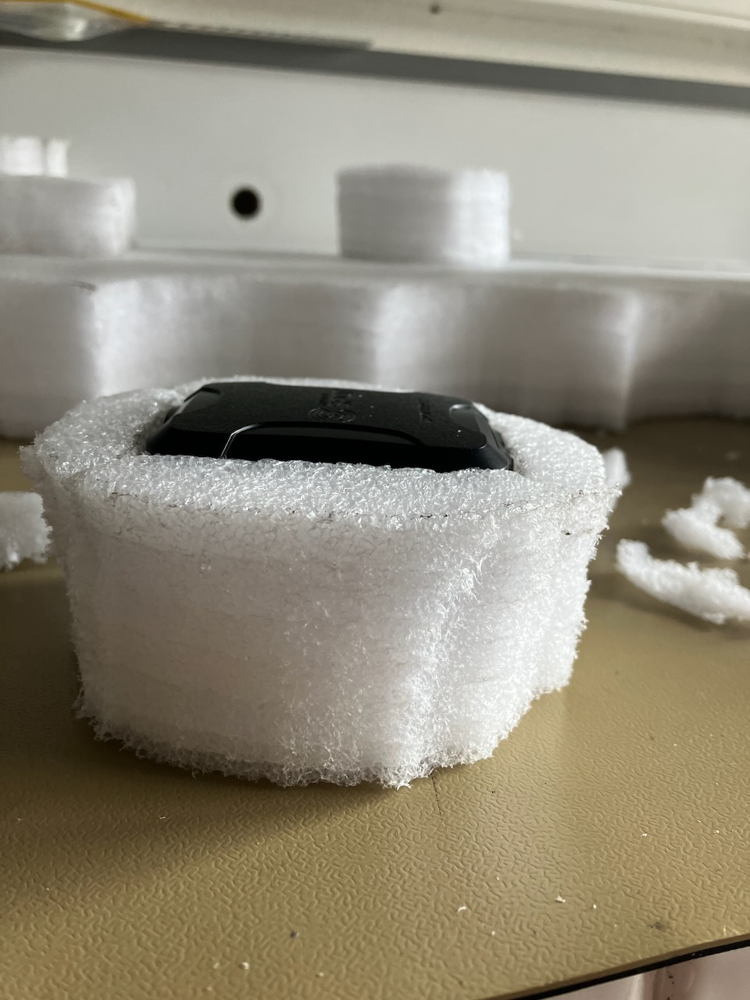
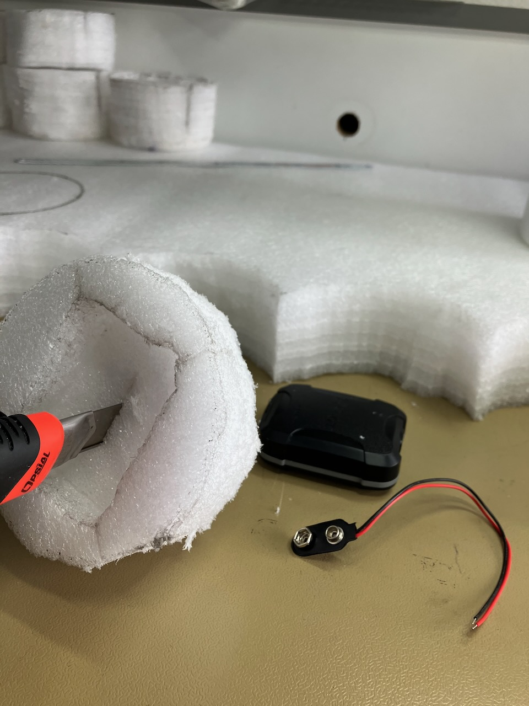
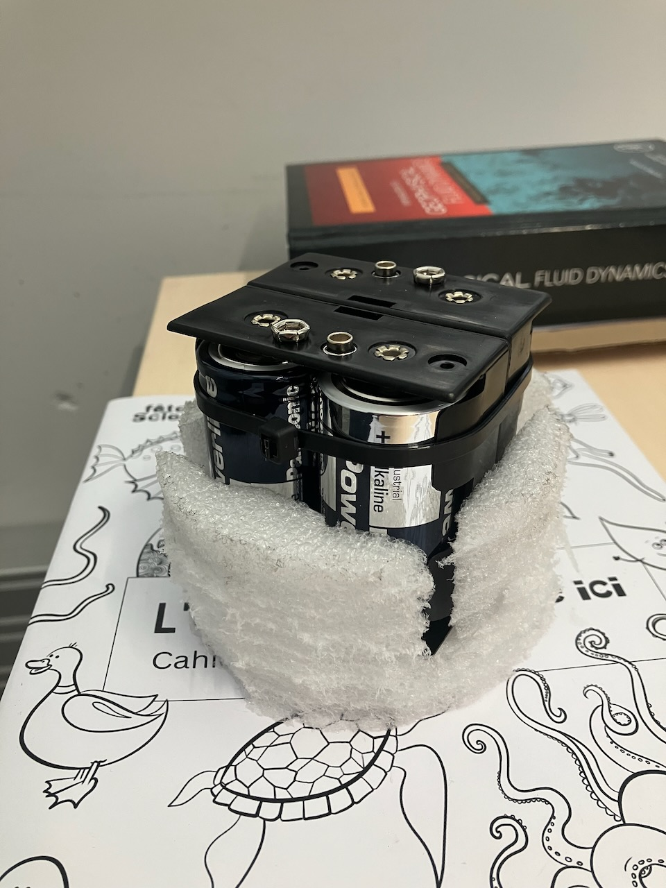
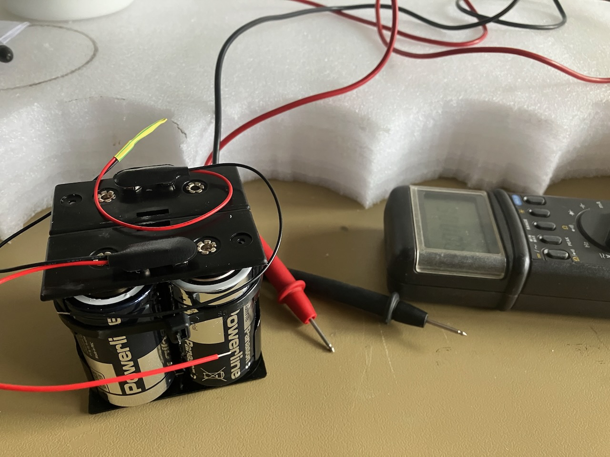
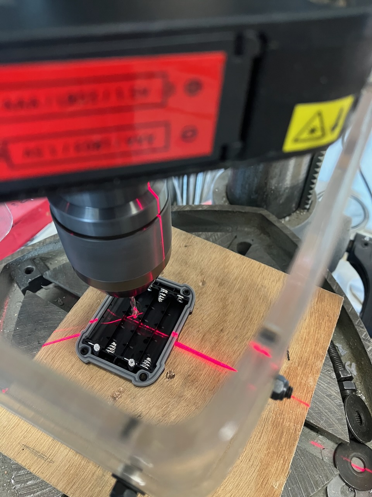

# Assembly

## Batteries and holders

1. Insert the batteries inside the two holders,
2. Hold them back to back using a hose clamp (or tape).

## Foam for wedging

1. Cut two circular pieces of foam with the same diameter as the pot:
    - One of 4 cm thickness for wedging the GPS tracer,
    - One of 6 cm thickness for wedging the batteries and holders.

    
    

2. In the 4 cm thick piece:
   - Make room for the GPS tracer by removing 2 cm height of foam with the appropriate shape,
  
    
    
    

    - Cut a hole allowing to pass through the electric wires from the battery holders to the tracer.
  
    

3. In the 6 cm thick piece, make room for the batteries and holders by removing 4 cm height of foam with the appropriate shape.

## Wiring

1. Connect the batteries in a series by soldering the positive and negative wires from the different battery holders,

    

2. Drill a hole in the back of the GPS tracer to pass the wires from the battery holders inside the GPS tracer,

    

3. Solder the remaining positive and negative wires to the positive and negative pins of the GPS tracer electronic card.

## Filling

1. Pour 460 g of gravel at the bottom for ~85% immersion,
2. On top of it, stuff the batteries and holders in its foam,
3. Lastly, stuff the GPS tracer in its foam, the tracer should be right under the plastic lid with the logo facing the sky.

