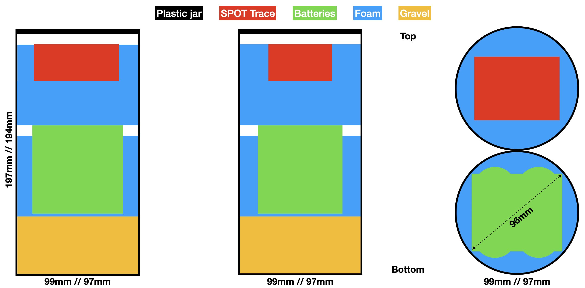

# Design

## Components and pricing

For building one drifter:

- 1 waterproof plastic pot. I used the Packo 1.3 L with the inner seal,
- 1 GPS tracer. I used the SPOT Trace,
- External batteries for powering the GPS tracer. I used 4 D type ones of 1.5 V, 19 Ah,
- Battery holders. I used a pair of 2-batteries holders connected in a series,
- Dense foam for wedging the components inside the pot,
- 460 g of gravel for lesting,
- Optional:
  - Waterproof tape for securing the pot lid,
  - Hose clamp or tape for holding the battery holders together,
  - Moisture absorber sachet.

At the time of writing (2025) it amounts for a total of less than 150€.

## Tooling

For assembling the drifters:

- 1 felt pen,
- 1 cutter,
- 1 welder (plus welding wire),
- 1 drill.

## Schematic

With approximated proportions it looks like this:

